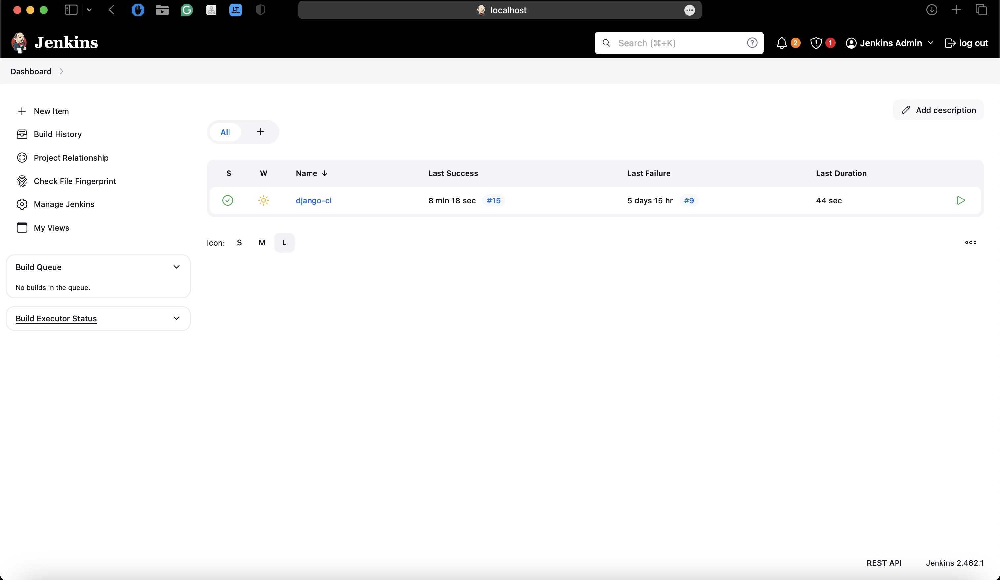

# Final Project – DevOps GoIT

## CI/CD Pipeline with Terraform, Jenkins, Argo CD, Prometheus & Grafana

## Опис

Цей проєкт реалізує повний CI/CD процес для Django-застосунку з використанням:

- **Terraform** — для автоматизованого створення AWS інфраструктури (VPC, EKS, ECR, Jenkins, Argo CD);
- **Jenkins** — для збірки Docker-образу, пушу в ECR і оновлення Helm chart;
- **Helm + Argo CD** — для автоматичного деплою нової версії застосунку у кластер Kubernetes.
- **Prometheus + Grafana** — моніторинг стану кластера та застосунку.

---

## Застосування Terraform

```bash
# Перейти у директорію проєкту
cd Progect

# Форматувати код
terraform fmt -recursive

# Ініціалізувати модулі та плагіни
terraform init -upgrade

# Переглянути план
terraform plan

# Застосувати інфраструктуру
terraform apply
```

Після виконання будуть створені:

- VPC + підмережі
- EKS кластер
- Jenkins (через Helm)
- Argo CD (через Helm)
- ECR репозиторій
- Argo Application для `django-app`
- Prometheus + Grafana (для моніторингу, розгорнуті через Helm у namespace `monitoring`)

---

## Перевірка Jenkins job

1. Отримати адресу Jenkins:

```bash
kubectl -n jenkins get svc jenkins \
 -o jsonpath='{.status.loadBalancer.ingress[0].hostname}{"\n"}'

```

або локально:

```bash
kubectl port-forward svc/jenkins 8080:8080 -n jenkins

```

2. Відкрити Dashboard Jenkins у браузері → знайти job **django-ci**.

3. Запустити або переглянути останній білд.  
   У логах мають бути:

   - збірка Docker-образу для Django;
   - пуш образу у Amazon ECR  
     `922718141496.dkr.ecr.eu-central-1.amazonaws.com/final-django:vX.Y`;
   - коміт у GitHub з оновленням `image.tag` у `values.yaml`.



## Argo CD

1. Отримати адресу Argo CD:

   ```bash
   kubectl -n argocd get svc argocd-server \
     -o jsonpath='{.status.loadBalancer.ingress[0].hostname}{"\\n"}'
   ```

2. Увійти в веб-інтерфейс Argo CD:

   - користувач: `admin`
   - пароль:
     ```bash
     kubectl -n argocd get secret argocd-initial-admin-secret \
       -o jsonpath="{.data.password}" | base64 -d
     ```

3. На дашборді побачити **Application `django-app`** зі статусом:
   ```
   Synced / Healthy
   ```

---

## Перевірка застосунку в Kubernetes

```bash
# Перевірити деплой, сервіс та HPA
kubectl -n default get deploy,svc,hpa -l argocd.argoproj.io/instance=django-app

# Отримати зовнішній хост застосунку
kubectl -n default get svc django-app-django \
  -o jsonpath='{.status.loadBalancer.ingress[0].hostname}{"\\n"}'

# Перевірити доступність (HTTP 200 OK)
curl -I http://<EXTERNAL-HOSTNAME>
```

---

## Схема CI/CD

```text
GitHub (branch lesson-8-9)
       |
    Jenkins (django-ci pipeline)
       |
  Docker image → Amazon ECR
       |
  Helm chart (values.yaml tag updated in Git)
       |
  Argo CD → EKS (sync application)
       |
  Django app доступний через LoadBalancer
```

## Моніторинг Prometheus + Grafana

Для моніторингу застосунків у кластері використовується Prometheus та Grafana.

### Встановлення Prometheus

```bash
kubectl create namespace monitoring

helm repo add prometheus-community https://prometheus-community.github.io/helm-charts
helm repo update

helm install prometheus prometheus-community/prometheus \
  --namespace monitoring
```

### Встановлення Grafana

```bash
helm repo add grafana https://grafana.github.io/helm-charts
helm repo update

helm install grafana grafana/grafana \
 --namespace monitoring \
 --set adminPassword=admin123

```

### Доступ до Grafana

```bash
kubectl port-forward -n monitoring svc/grafana 3000:80

```

Після цього Grafana буде доступна локально: http://localhost:3000
Увійти з обліковими даними:
• Логін: admin
• Пароль: admin123 (задано при встановленні)
